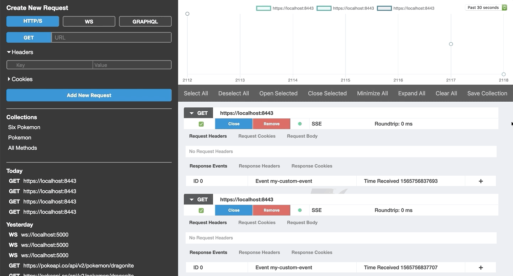
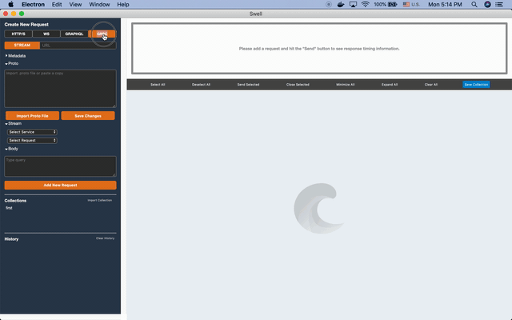

#

Swell is a API development tool that enables developers to test  endpoints served over streaming technologies including Server-Sent Events (SSE), WebSockets, HTTP2, GraphQL and gRPC.

## Getting Started

Visit www.getswell.io to download the latest release. 

Swell is currently available for OS X, Linux and Windows.

## Highlights
Swell is a one-stop shop for sending and monitoring your API requests

* Send and monitor streams over HTTP2 (including SSEs) and WebSockets
* Create GraphQL queries, mutations, and subscriptions
* Provides full streaming testing support for gRPC
* Support for up to six concurrent connections
* View request/response timing information in an interactive chart
* Save requests in "collections" of multiple requests
* Import and export "collections" for sharing

## Supported Technologies
* *HTTP2*: Swell supports full HTTP2 multiplexing of requests and responses. HTTP requests to the same host will be sent over the same connection. Swell will attempt to initiate an HTTP2 connection for all HTTPS requests by default, but will revert to HTTP1.1 for legacy servers.
<kbd></kbd>

* *Server-Sent Events (SSE)*: Swell displays SSE events one by one as they come in.
<kbd></kbd>

* *WebSocket (WS)*: Swell enables connecting directly to WebSocket servers with an HTTP handshake. Developers can directly send messages to the connected WS server. Messages are displayed in chatbox format, clearly indicating outgoing and incoming messages.
<kbd></kbd>

* *GraphQL*: Swell includes full support for all three root types of GraphQL - queries, mutations, and subscriptions - with and without variables
<kbd></kbd>

### **Latest Swell v.0.4.0 update**
* *gRPC*: Swell includes full support for all four streaming types of gRPC - unary, client stream, server stream, bidirectional stream
<kbd></kbd>

## Additional Features
* *Collections*: Swell allows you to save collections for easier testing of multiple requests.
<kbd></kbd>

* *Import/Export Collections*: Swell allows you to import and export collections, making it easy to share collections with your team.
<kbd></kbd>

## How to run tests

* Jest
To run unit tests that check for relevant component rendering, use: "npm run test-jest"

* Mocha
To run functional tests that check for functionality of each API network protocol, use: "npm run test-mocha"

Note: For the HTTP test to work, you will have to add a .env file with any MONGO URI.
E.g., MONGO_URI = "mongodb+srv://YOUR_URL"

## Built With
* Electron
* React
* Redux
* Apollo Client
* Websockets
* IndexedDB
* Chart.js

## Authors

* **Anthony Terruso** - [discrete projects](https://github.com/discrete-projects)
* **Brandon Marrero** - [brandon6190](https://github.com/brandon6190)
* **Jason Ou** - [jasonou1994](https://github.com/jasonou1994)
* **Kyle Combs** - [texpatnyc](https://github.com/texpatnyc)
* **Kwadwo Asamoah** - [addoasa](https://github.com/addoasa)
* **Abby Chao** - [abbychao](https://github.com/abbychao)
* **Amanda Flink** - [aflinky](https://github.com/aflinky)
* **Kajol Thapa** - [kajolthapa](https://github.com/kajolthapa)
* **Billy Tran** - [btctrl](https://github.com/btctrl)
* **Paul Rhee** - [prheee](https://github.com/prheee)
* **Sam Parsons** - [sam-parsons](https://github.com/sam-parsons)
* **Nancy Dao** - [nancyddao](https://github.com/nancyddao)
* **Evan Grobar** - [egrobar](https://github.com/egrobar)
* **Dan Stein** - [danst3in](https://github.com/danst3in)
* **Amruth Uppaluri** - [amuuth](https://github.com/amuuth)
* **Yoon Choi** - [cyoonique](https://github.com/cyoonique)

## License

This project is licensed under the MIT License
