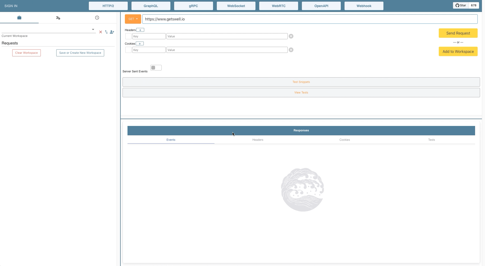

#

Swell is a API development tool that enables developers to test  endpoints served over streaming technologies including Server-Sent Events (SSE), WebSockets, HTTP2, GraphQL and gRPC.

## Getting Started

Visit www.getswell.io to download the latest release. 

Swell is currently available for OS X, Linux and Windows.

## Highlights
Swell is a one-stop shop for sending and monitoring your API requests

* Send and monitor streams over HTTP2 / HTTP1 (including SSEs) and WebSockets
* Create GraphQL queries, introspections, mutations, and subscriptions
* Provides full streaming testing support for gRPC
* View response timing information and history in an interactive chart for each request
* Save workspaces of multiple requests for later access
* Import and export workspaces for sharing

## Supported Technologies
* *HTTP2*: Swell supports full HTTP2 multiplexing of requests and responses. HTTP requests to the same host will be sent over the same connection. Swell will attempt to initiate an HTTP2 connection for all HTTPS requests by default, but will revert to HTTP1.1 for legacy servers.  Multiple concurrent streams are allowed for each connection.
<kbd></kbd>

* *Server-Sent Events (SSE)*: Initiated by a simple toggle box, Swell displays SSE events one by one as they come in.  Similar to HTTP2 streams, multiple open connection streams are allowed for SSE.
<kbd></kbd>

* *WebSocket (WS)*: Swell enables connecting directly to WebSocket servers with an HTTP handshake. Developers can directly send messages to the connected WS server. Messages are displayed in chatbox format, clearly indicating outgoing and incoming messages.
<kbd></kbd>

* *GraphQL*: Swell includes full support for all three root types of GraphQL - queries, mutations, and subscriptions as well as Introspection - with and without variables.  Smart code editor allows for easy query creation.
<kbd></kbd>

* *gRPC*: Swell includes full support for all four streaming types of gRPC - unary, client stream, server stream, bidirectional stream.
<kbd></kbd>

## Additional Features
* *Workspaces*: Swell allows you to save workspaces for easier testing of multiple requests.
* *Import/Export Workspaces*: Swell allows you to import and export workspaces, making it easy to share collections with your team.
<kbd></kbd>

## Built With
* Electron
* React
* Redux
* Apollo Client
* Websockets
* IndexedDB
* Chart.js

## Authors

* **Grace Kim** - [gracekiim](https://github.com/gracekiim)
* **Alex Sanhueza** - [alexsanhueza](https://github.com/alexsanhueza)
* **Wyatt Bell** - [wcbell51](https://github.com/wcbell51)
* **John Madrigal** - [johnmadrigal](https://github.com/johnmadrigal)
* **Michael Miller** - [mjmiguel](https://github.com/mjmiguel)
* **Hideaki Aomori** - [h15200](https://github.com/h15200)
* **Matt Gin** - [chinsonhoag](https://github.com/chunsonhoag)
* **Nick Healy** - [nickhealy](http://github.com/nickhealy)
* **Grace Spletzer** - [gspletzer](https://github.com/gspletzer)
* **Stephanie Wood** - [stephwood](https://github.com/stephwood)
* **Anthony Terruso** - [discrete projects](https://github.com/discrete-projects)
* **Brandon Marrero** - [brandon6190](https://github.com/brandon6190)
* **Jason Ou** - [jasonou1994](https://github.com/jasonou1994)
* **Kyle Combs** - [texpatnyc](https://github.com/texpatnyc)
* **Kwadwo Asamoah** - [addoasa](https://github.com/addoasa)
* **Abby Chao** - [abbychao](https://github.com/abbychao)
* **Amanda Flink** - [aflinky](https://github.com/aflinky)
* **Kajol Thapa** - [kajolthapa](https://github.com/kajolthapa)
* **Billy Tran** - [btctrl](https://github.com/btctrl)
* **Paul Rhee** - [prheee](https://github.com/prheee)
* **Sam Parsons** - [sam-parsons](https://github.com/sam-parsons)
* **Nancy Dao** - [nancyddao](https://github.com/nancyddao)
* **Evan Grobar** - [egrobar](https://github.com/egrobar)
* **Dan Stein** - [danst3in](https://github.com/danst3in)
* **Amruth Uppaluri** - [amuuth](https://github.com/amuuth)
* **Yoon Choi** - [cyoonique](https://github.com/cyoonique)
* **Nathaniel Adams** - [nathanielBadams](https://github.com/nathanielBadams)
* **Robin Yoong** - [robinyoong](https://github.com/robinyoong)
* **Gary Slootskiy** - [garyslootskiy](https://github.com/garyslootskiy)
* **Sam Haar** - [samhaar](https://github.com/samhaar)

## License

This project is licensed under the MIT License
