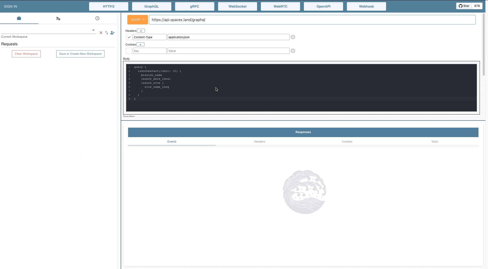
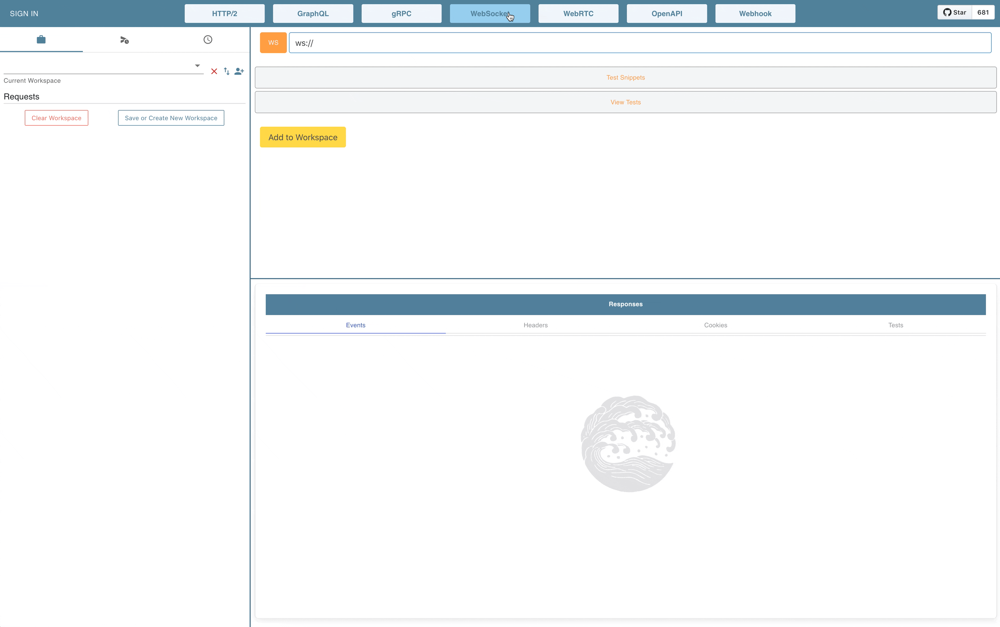

# Swell

[](https://github.com/open-source-labs/Swell/blob/master/LICENSE.txt)

[](https://github.com/getswell/getswell/issues)
[](https://twitter.com/intent/tweet?text=Swell-%20For%20all%20your%20streaming%20API%20testing%20needs&url=https://www.getswell.io&hashtags=SSE,WebSocket,HTTP,API,developers)

Swell is an API development tool that enables developers to test HTTP2, GraphQL endpoints, as well as ones served over streaming technologies including Server-Sent Events (SSE), WebSockets, gRPC, WebRTC, and OpenAPI.

## Getting Started

Visit www.getswell.io to download the latest release.

Swell is available for OSX, Linux, and Windows.

## Highlights

Swell is a one-stop shop for sending and monitoring your API requests:

- Send and monitor streams over HTTP/2 (including SSEs) and WebSockets
- Create GraphQL queries, introspections, mutations, and subscriptions
- Stress testing HTTP/2 and GraphQL endpoints
- Create your own HTTP/2 mock server
- Store workspaces of multiple requests for later use
- Import and export workspaces locally
- Compose test suites in JavaScript with Chai-style TDD/BDD assertion syntax

## Core features

- _HTTP2_: Swell supports full HTTP2 multiplexing of requests and responses. HTTP requests to the same host will be sent over the same connection. Swell will attempt to initiate an HTTP2 connection for all HTTPS requests by default, with the ability to revert to HTTP1.1 for legacy servers. Multiple concurrent streams are allowed for each connection.
  

- _GraphQL_: Swell includes full support for all three root types of GraphQL - queries, mutations, and subscriptions – as well as Introspection. Variables are also supported, making creating queries easy.
  

- _Server-Sent Events (SSE)_: Initiated by a simple toggle box, Swell displays SSE events one by one as they come in. Similar to HTTP2 streams, multiple open connection streams are allowed for SSE.
  

- _WebSockets (WS)_: Swell enables connecting directly to WebSocket servers with an HTTP handshake, with developers able to send messages to the connected WS server directly. All outgoing and incoming messages are displayed in real time.
  

## Additional features

- _Stress testing for HTTP/2 and GraphQL_: Test your server backend with Swell's stress testing feature to ensure your server can manage expected and unexpected loads accordingly
  
  

- _Send Requests Directly to an Endpoint_: You are able to immediately send a request to an endpoint OR stage a request in your workspace for multi-level testing.
  

- _Scripting in Swell_: If you favor test-driven development, Swell allows you to write assertion tests to aid defining and testing backend API services.
  

- _Workspaces_: Swell allows you to save workspaces for easier testing of multiple requests.

- _Preview_: You can now view a rendered preview of certain API responses (HTML)
  
- _Collection Runner_: You can also stage requests in the workspace and automate the process of sending off each one. No need to manually press send on each one; instead each request will fire off in the order of staging.
  

## Experimental Features

- _Mock Server_: Swell allows you to create your own HTTP/2 mock server to facilitate front-end development without depending on a fully built backend server.
  

- _gRPC_: Swell includes full support for all four streaming types of gRPC - unary, client stream, server stream, bidirectional stream.
  

- _tRPC_: Swell includes full support for all methods of TypeScript Remote Procedure Calls including batch call support for queries and mutations.
  
  

  Calls are currently being made using Swell's own TRPCProxyClient generated from the URL provided by the user.
  Batch requests must be entered one request per line. Swell will treat each line of code entered into the editor as a separate request before batching and returning responses.
  Each request must follow the general format client.procedure.querytype(). For example:

  ```js
  client.getUser.query({ name: 'Luke Skywalker' });
  ```

  See [tRPC docs](https://trpc.io/docs/) for more information on sending tRPC requests or setting up a tRPC server.

- _Webhooks_: Swell includes user-defined HTTP callback connection testing designed to test other server's connection to the web and ability to send data. The test insures that when an event occurs, the source site makes an HTTP request to the URL configured for the webhook.
  

- _WebRTC_: Swell makes it easy to test STUN and TURN ICE server connectivity for WebRTC applications.  
  

  Currently, it is a read-only feature. When the write feature for ICE server is enabled, ICE server details can be entered as an array of JavaScript objects (example code block below). An RTCPeerConnection will be instantiated, as an SDP is generated.

  ```js
  [
    {
      urls: 'turn:111.222.333.444:54321',
      username: 'myAwesomeUsername',
      credential: 'mySecretPassword', // or token
      credentialType: 'password',
    },
    {
      urls: 'stun:555.777.888.999:43210',
    },
  ];
  ```

- _OpenAPI_: Swell supports the enumeration and execution of REST and RPC API requests as defined in a user-provided OpenAPI document.
  

## Built With

- Electron
- React
- React Router
- Material UI
- Redux
- Apollo Client
- Websockets
- gRPC-js
- tRPC
- VM2
- Chart.js
- Bulma
- IndexedDB
- Chai
- Mocha
- Playwright

## Considering iterating Swell in the future?

Feel free to check out the `DEV-README.md` in the `docs` folder.

## Authors

- **Chris Suzukida** - [csuzukida](https://github.com/csuzukida)
- **Fred Kim** - [Fredkim21](https://https://github.com/Fredkim21)
- **Jason Huang** - [jjhuang3](https://https://github.com/jjhuang3)
- **Nattie Chan** - [nattiechan](https://https://github.com/nattiechan)
- **Jack Sonoda** - [jackksono](https://github.com/jackksono)
- **Jaden Nguyen** - [jaden-nguyen](https://github.com/jaden-nguyen)
- **Taner Malmedal** - [tannermalmedal](https://github.com/tannermalmedal)
- **Mihran Baytaryan** - [mihran-baytaryan](https://github.com/mihran-baytaryan)
- **David Beame** - [KingzandBean](https://github.com/KingzandBean)
- **Grace Kim** - [gracekiim](https://github.com/gracekiim)
- **Alex Sanhueza** - [alexsanhueza](https://github.com/alexsanhueza)
- **Wyatt Bell** - [wcbell51](https://github.com/wcbell51)
- **John Madrigal** - [johnmadrigal](https://github.com/johnmadrigal)
- **Michael Miller** - [mjmiguel](https://github.com/mjmiguel)
- **Hideaki Aomori** - [h15200](https://github.com/h15200)
- **Matt Gin** - [chinsonhoag](https://github.com/chunsonhoag)
- **Nick Healy** - [nickhealy](http://github.com/nickhealy)
- **Grace Spletzer** - [gspletzer](https://github.com/gspletzer)
- **Stephanie Wood** - [stephwood](https://github.com/stephwood)
- **Anthony Terruso** - [discrete projects](https://github.com/discrete-projects)
- **Brandon Marrero** - [brandon6190](https://github.com/brandon6190)
- **Jason Ou** - [jasonou1994](https://github.com/jasonou1994)
- **Kyle Combs** - [texpatnyc](https://github.com/texpatnyc)
- **Kwadwo Asamoah** - [addoasa](https://github.com/addoasa)
- **Abby Chao** - [abbychao](https://github.com/abbychao)
- **Amanda Flink** - [aflinky](https://github.com/aflinky)
- **Kajol Thapa** - [kajolthapa](https://github.com/kajolthapa)
- **Billy Tran** - [btctrl](https://github.com/btctrl)
- **Paul Rhee** - [prheee](https://github.com/prheee)
- **Sam Parsons** - [sam-parsons](https://github.com/sam-parsons)
- **Nancy Dao** - [nancyddao](https://github.com/nancyddao)
- **Evan Grobar** - [egrobar](https://github.com/egrobar)
- **Dan Stein** - [danst3in](https://github.com/danst3in)
- **Amruth Uppaluri** - [amuuth](https://github.com/amuuth)
- **Yoon Choi** - [cyoonique](https://github.com/cyoonique)
- **Nathaniel Adams** - [nathanielBadams](https://github.com/nathanielBadams)
- **Robin Yoong** - [robinyoong](https://github.com/robinyoong)
- **Gary Slootskiy** - [garyslootskiy](https://github.com/garyslootskiy)
- **Sam Haar** - [samhaar](https://github.com/samhaar)
- **Edward Cho** - [edwardcho1231](https://github.com/edwardcho1231)
- **Miguel Gonzalez** - [MigGonzalez](https://github.com/MigGonzalez)
- **Jason Liggayu** - [jasonligg](https://github.com/jasonligg)
- **Warren Tait** - [whtait](https://github.com/whtait)
- **Nathan Fleming** - [njfleming](https://github.com/njfleming)
- **Konrad Kopko** - [konradkop](https://github.com/konradkop)
- **Andrea Li** - [Andrea-gli](https://github.com/Andrea-gli)
- **Paul Ramirez** - [pauleramirez](https://github.com/pauleramirez)
- **TJ Wetmore** - [TWetmore](https://github.com/TWetmore)
- **Colin Gibson** - [cgefx](https://github.com/cgefx)
- **Ted Craig** - [tedcraig](https://github.com/tedcraig)
- **Anthony Wong** - [awong428](https://github.com/awong428)
- **John Jongsun Suh** - [MajorLift](https://github.com/MajorLift)
- **Christopher Pan** - [ChristopherJPan](https://github.com/ChristopherJPan)
- **Adrian Uesugui** - [auesugui](https://github.com/auesugui)
- **Jennifer Wu** - [jsh-wu](https://github.com/jsh-wu)
- **Jacob Viesselman** - [JacobViesselman](https://github.com/JacobViesselman)
- **Michael Prince** - [MichaelGPrince](https://github.com/MichaelGPrince)
- **Genevieve Annable** - [gigifeeds](https://github.com/gigifeeds)
- **Jay Wall** - [hanswand](https://github.com/hanswand)
- **Sam Pyo** - [samhpyo](https://github.com/samhpyo)
- **Drew Pomatti** - [thedrewery](https://github.com/thedrewery)
- **Kurtis Waterbury** - [kurto8](https://github.com/kurto8)
- **Yale Yng-Wong** - [ywy-w](https://github.com/ywy-w)
- **Evelin Goldin** - [evelingoldin](https://github.com/evelingoldin)
- **Alexander Adams** - [alex-e-adams](https://github.com/alex-e-adams)
- **Ethan Sclarsky** - [esclarsky](https://github.com/esclarsky)
- **Travis Lovis** - [tlovis](https://github.com/tlovis)
- **HyeJin Kim** - [hyejinkim](https://github.com/hyejinkim)
- **Alexa Nunes** - [A13xaNunes](https://github.com/A13xaNunes)
- **Michael Smith** - [Parkreiner](https://github.com/Parkreiner)

## License

This project is licensed under the MIT License
