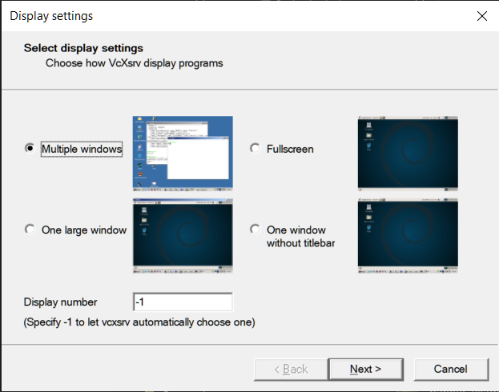
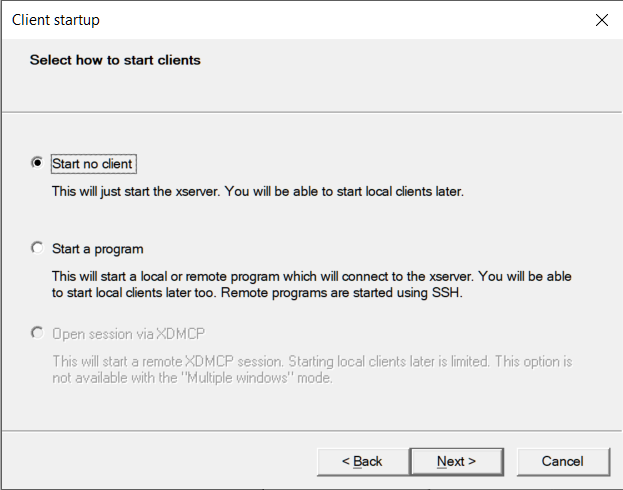
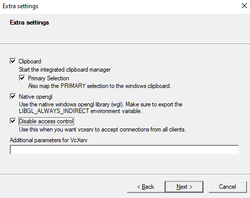
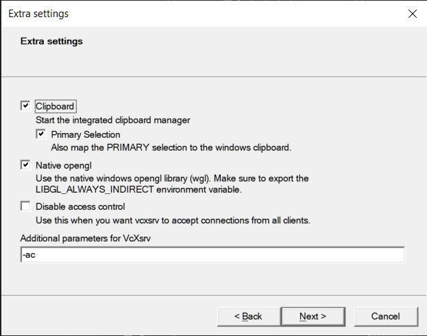

# Contributing to Swell in the context of a group/medium-term project

If you are considering contributing to Swell in the context of a group or medium-term project, you are at the right place! Here is a document that will give you more information regarding the state of the product and some considerations for future iteration.

NOTE: Here is a super useful excalidraw that describes the processes of the application in detail: https://excalidraw.com/#room=18f1f977e8cd6361eaa1,4vr1DznwcnD-uKM_X7ZhiA

here is on redux and interprocess communication in electron
https://excalidraw.com/#json=814-HNYqTvOb6ukLgWjye,QhmJCXv8x3-BC_oSH2gjCQ

## Maintaining this Document

This should serve as an entry point for any developers who wish to iterate on Swell and therefore, should be kept as up-to-date as possible. **At the end of your iteration, you are strongly encouraged to update this document for future developers.**

Thank you for your consideration and let's work together on making Swell one of the best open-source products to contribute!

---

## As a developer, what experience can you get out of contributing to Swell?

- TypeScript + JavaScript
- React
- Redux
- SASS
- Node
- Express
- Webpack
- Client-side storage (IndexedDB)
- GitHub Actions (CI/CD)
- Testing:
  - Unit testing with Jest
  - End-to-end (E2E) testing with Playwright and Mocha/Chai
- Advanced and/or specialized knowledge of:
  - Electron
  - APIs: HTTP/2, GraphQL
  - API served over streaming technologies:
    - Server-Sent Events (SSE)
    - WebSockets
    - gRPC
    - tRPC
    - WebRTC
    - OpenAPI

## How to download and test the application locally?

1. Fork and/or clone the repository into your local machine
2. In your terminal:
   - `npm install`, then
   - `npm run dev`
3. Wait for the electron application to start up (it may take a bit)

There is E2E testing available via `npm run test`. Note that not all tests in the E2E test suite work currently. Please refer to `./test/testSuite.js` and `./test/subSuites` for more details.

---

## What is the way to render an electron app during development for WSL users?

WSL and Electron do not work well together without some additional steps - the application won't load when using `npm run dev`. We have a few solutions you can try, but it is not by any means the only way or even guaranteed method.

- One solution suggestion is to download the repo directly on your Windows machine and not use WSL.
- Another solution is to use `Xserver` (graphical interface for Linux) to render things from Linux onto your Windows.
  - The following below is a streamlined and hopefully beginner friendly step-by-step that may work for most people with additional references below in case you encounter issues.
    - **We highly recommend reviewing all the steps first BEFORE proceeding (and ideally the references as well) to have a good understanding before proceeding**
    - **Also verify you are using WSL2 and not WSL1, run `wsl --version` within powershell if you are not sure**
      - If you need to upgrade from WSL1 to WSL2, you can run `wsl --set-default-version 2` within powershell.

1. You will need to install the electron dependencies inside of your WSL to make sure electron has all the necessary components (If you want to be cautious, now would be a good time to make a backup of your linux subsystem but it is not essential). Once you are ready, run the following command in you Linux terminal:
   - `sudo apt install libgconf-2-4 libatk1.0-0 libatk-bridge2.0-0 libgdk-pixbuf2.0-0 libgtk-3-0 libgbm-dev libnss3-dev libxss-dev`
2. In your WSL system's `.bashrc` file, typically located in you user folder `\\wsl.localhost\<distro-name>\home\<username>\`, add the following line to the end of the file:
   - `` export DISPLAY="`sed -n 's/nameserver //p' /etc/resolv.conf`:0" ``
   - **PLEASE NOTE: Any time you make changes to the main WSL files like `.bashrc` or `.profile` (especially if troubleshooting later), you will need to restart you entire WSL (Not just shutdown VSCode) in order for the changes to take effect. Save your work/changes, close VSCode, open a windows terminal and type in `wsl --shutdown`. You should then be able to boot up as you normally do with the new settings applied.**
3. Install XServer, specifically VcsXsrv:
   - If you have chocolatey installed on Windows, you can run the following command from the Windows command line or from PowerShell `choco install vcxsrv`
     - See [here](https://community.chocolatey.org/packages/vcxsrv) for the link on more information about this package. Other repo management tools for Windows are perfectly fine as well (i.e `scoop.sh` or such).
     - See [this link](https://chocolatey.org/install) if you don't have a package manager for Windows to get started using Chocolatey.
     - Once installed open VcsXsrv (should be listed and searchable as `XLaunch` in Windows) and it’ll guide you through three config screens. Here’s what to pick on each one:
       - Choose Multiple Windows  
         
       - Choose ‘Start no client’  
         
       - Choose Clipboard, OpenGL integration, and Disable access control  
         
       - Alternatively: you can also choose Clipboard and OpenGL integration, plus provide -ac as additional parameters  
         
       - Save your config in any folder that's for easy to reach for launching (as this will be the one you use to actually start-up Xserver), then start the server by double clicking on it. You’ll now see the little X logo in your system tray. We’re ready to go.
         - If you make any mistakes in creating your config, you can always open `XLaunch` again and create a new config file to replace the old one or create a different one for testing.
4. You should now be able to run `npm run dev` from the terminal as you would normally to boot up the software. Links will open in your browser as it loads, be patient. It may take up to a few minutes to complete, but eventually you should see a new window pop-up with Swell running.
   - Please note there may be several errors that pop up in your terminal that may reference outdated packages or be in reference to other components as well. This is normal depending on the state of the software and any changes you've made, but it's worth reviewing if you encounter issues.
5. **Potentially Necessary** After these steps, if it is still not working, you may have to enable WSL to access `Xserver` on Windows Firewall
   - If so, refer to this [skeptric](https://skeptric.com/wsl2-xserver/) article

Here are the articles we used as reference, we suggest reading through these for any troubleshooting and for a better understanding overall.

- **NOTE: There are some discrepancies between the two articles and user experiences on where to place the additional lines of code, whether inside of your `.bashrc` file or your `.profile` file. We suggest trying to use ONLY the single line shown in step 2 above in your `.bashrc` file, unless it doesn't work for you**
- **Additionally, there are further variances on what specific lines of code to add the ones outlined above should suffice, but if the do not then please try the steps outlined in these articles. Just remember to restart WSL if changing any code in the `.bashrc` or `.profile` files.**
  - [This article](https://www.beekeeperstudio.io/blog/building-electron-windows-ubuntu-wsl2) was really for getting things to work and understanding the larger picture.
  - There is another article [here](https://skeptric.com/wsl2-xserver/) that you may want to check out as well and some of us found more helpful and explains how to set up Windows Firewall as referenced in Step 5.
    - If following the second article, others have suggested yet another script instead of what they put: `export DISPLAY=$(/sbin/ip route | awk '/default/ { print $3 }'):0`
    - Some additional alternatives are `export DISPLAY=$(grep nameserver /etc/resolv.conf | awk '{print $2}'):0`

---

## What is the current state of the application?

From a functionality standpoint:

- Consistent UI/UX styling and color palette
- Toggleable Dark Mode
- Make requests via HTTP/2
- Query, Mutation, Subscribe/unsubscribe to GraphQL endpoints
- Query, Mutation, Subscribe/unsubscribe to tRPC endpoints
- HTTP/2 stress testing with `GET` requests
- GraphQL stress testing with `Query`
- Mock server for HTTP/2 (`Express`)
- Ability to store historical requests and create/delete workspaces
- Frontend conversion to TypeScript
- From a codebase standpoint:
  - Increased the quality of TypeScript with continuing conversion
  - Conversion to Redux toolkit is complete (fully implemented useSelector and useAppDispatch)
  - 60% coverage of working E2E testing (more details in `./test/testSuite.js`)

---

## What are some of the features that require future iteration?

### _Continue reducing the size and complexity of the codebase_

This codebase has an interesting combination of over-modularization and code de-centralization/duplication occurring at the same time. For example - each type of API endpoint composer window (top right section of the app) is its own module/file, but a lot of the code inside is duplicated (see `Http2Composer.tsx` and `GraphQLComposer.tsx`).
The reason many iteration groups have stayed away is because one would need to craft a function/component that is flexible enough to handle the population of the reqRes object and dispatch the state to the various slices. This is not an easy task and may take the entire iteration time allotted. It would be a worthy
endeavour. The impacts to the product are:

- The codebase can be challenging to navigate if you are not familiar with the structure
  - That being said, the file structure has been extensively modified to make the navigation much easier. The most demanding aspects involve understanding how state flows through the application, from the front-end to main_process, controllers, etc.
  - This is the most important thing to understand when iterating on Swell
- The app is slow to load in all environments (production, development, test)
  - Adding multiple entry points to the build process would greatly improve this, but be careful because you can end up making performance much worse in the process

**Some of us have found the [ReacTree](https://reactree.dev/) VS Code extension or the [Sapling](https://marketplace.visualstudio.com/publishers/team-sapling) VS Code extension incredibly helpful in visualizing the UI components. Utilizing the extension could be your entry into understanding the structure of the codebase.**

**Some of us have found Redux Dev Tools incredibly helpful when trying to understand the flow of state and actions. Redux Dev Tools is installed when running in development mode and can be accessed as the right-most tab in your developer console panel in Electron.**

As you iterate the product, keep in mind the footprint your new feature(s) could add to the codebase. Could you re-use some of the existing modules? Can you even refactor and/or remove the obsolete code to help maintain the health of the codebase?

There are many parts of the codebase that break DRY principles, and with such a large application, really keep in mind that when you add features to ask if it is completely necessary. Past iterators added an experimental feature(s) without it fully working and the following team(s) would add their own experimental feature. Fixing features the past teams couldn't get to is not only a great way to learn these technologies but also a great thing to talk about in interviews. "I fixed the webRTC feature that has been stagnant for 5 years", "I addressed the technical debt and reorganized the state...", or "Increased the quality of typeScript". These all show maturity as a developer and will allow us to focus the entire time of OSP on the final 20% problems.

Legacy Components - As a part of a clean up effort, all files that are no longer being used have been moved to the legacy component folder. Examples of these files come from the migration to shared components. The original location of the components is mentioned in the comments of the relocated files.

### _Ensure consistent redux state management_

The redux state initiation and management for various API endpoints in this codebase are inconsistent. If you cross reference the state initialization, transition/update, and clean up in various modules with `types.ts`, you will notice many TypeScript typing errors due to inconsistent state management. This will need to be cleaned up bit by bit to ensure a state that works across all types of APIs in this application.

### _Continue improving UX/UI consistency in the app_

The UX/UI styling and functionality are not consistent across different API endpoints. For example, there is a `Send Request` button for HTTP/2, but not for GraphQL.

Moreover, the application lacks instructions on how to utilize some of the more advanced features like WebSocket and tRPC. Having some written explanation of how the feature works on the app would be tremendously helpful.

Lastly, when making the app smaller on a Windows desktop or using a computer with a smaller screen size, some of the buttons are partially cut out. It would be great to establish a minimum size for each section and/or input field so the application can auto-resize elegantly.

You will notice that there are a few places where MUI is used. Material UI is a huge component library that is popular, though figuring out how to lessen Swell's dependence on it would go a long way to reducing its bloat. However previous groups intended fully convert the application to utilize Material UI. In which case following groups should either decide to fully implement it or fully remove the dependency.

### _Streamline Dark Mode alongside UX/UI changes_

Dark Mode has been re-implemented as of v1.18 and a toggle button was added to the top right corner. It works across the entire application, however the following could use improvement:

- Certain drop-down buttons appear too dark, matching the background in the current state but otherwise are readable and function normally, but the contrast of the text could be improved.

However it's setup is not ideal should serve as a temporary fix.

Currently the isDark state is held inside of `uiSlice.ts` and the toggle button is rendered inside of `DarkModeSelect.tsx`. The functionality relies heavily on the following components:

- `darkMode.scss` contains the color palette of the classes
- Many of the individual rendered components (such as headers, buttons, or url entry forms) relied on in-line css ternary operators to check the state of isDark and apply appropriate classes when isDark is `true`.
  - For example `${isDark ? 'is-dark-400' : ''}`
- Some items directly rely on the `darkMode.scss`, but for the remainder of Material UI components, there is a theme set in `index.js` to make the background match the color palette. Because Material UI could not use the darkMode.scss colors directly, the colors had to be hard-coded to match the current color configurations. As such there is a lightTheme and a darkTheme that gets directly rendered in `index.js` based on the state of isDark in `uiSlice.ts`.

A more ideal solution would more closely reassemble the classes themselves getting modified if isDark is set to `true` so that there is less reliance on inline HTML classes utilizing the existing ternary operator.

Additionally, depending on how future groups iterate on the Material UI components, the themes should be integrated so that there is a single source of truth rather than in both `index.js` and `darkMode.scss`.

Please also note that the testing created in `darkModeToggleTest.js` checks for the correct icons being shown between light and dark mode and that the correct state gets sent to `uiSlice.ts` when pressed. If the icons are modified, this may fail the test.

### _Continue TypeScript code improvements and conversion_

TypeScript provides strong typing to improve code quality, and maintainability and reduce runtime errors. Currently, TS usage across the app is inconsistent at best. Numerous files are 'converted' to TS, but are using a band-aid type called $TSFixMe. If you look in types.ts, you can see that this is just the any type, which defeats the purpose of using TS in the first place. As of v1.18, all of MainContainer and all of the GraphQL-composer folder are free of type errors. The process for fixing $TSFixMe's involves importing the proper types from types.ts wherever possible and creating custom types in file where necessary.

It is also important to note that props are being drilled down from MainContainer into child components, which have their own custom prop types in types.ts that extend MainContainer. In the future, contributors may want to consider typing child components separately and only prop drill from MainContainer what is truly necessary in each component. Or, alternatively, it might be better to eliminate prop drilling altogether and pull functions in directly from the redux store

### _CSP Changes and Improvements_

#### nonce/sha-256 CSP script/style changes
- Added CSP nonce to the scripts being ran in the app to prevent potential XSS attacks
- Implemented a cache to catch Material UI dynamic styling – still need to a way to parse nonce value from webpack into the cache [index.js]
- Moved rendering from index.js and moved entry point to index-csp.html and used webpack as template
- Added nonce generation and potential sha-256 generation for from webpack

#### Remaining Items to Implement
- Nonce is currently generated once per build – find a way to change nonce on every launch
- Find a way to integrate nonce into material ui cache on index.js

### _Enhance HTTP/2 Mock server functionality_

Currently, the HTTP/2 mock server has the ability to create a server that is accessible outside of the application and create any endpoint that the user chooses. There could be a lot of potential to enhance the current mock server to include features such as:

- Add an option to see the list of existing routes that show up in the response window
- Add endpoint validation
- the ability to mock HTML responses (or remove the HTML option from the BodyEntryForm component)
- Connect the headers and cookies to the mock endpoint creation

### _WebRTC features are there but may buggy when interacting with other parts of the app according to previous groups_

In a recent iteration, the WebRTC feature was changed from STUN Server testing to Client RTC Connection testing, allowing Swell to test if another client is able to create an RTC connection to transmit text and video data. Because the RTCPeerConnection has to be initiated before we generate the SDP, this connection is set up differently from the other networks. Other networks purely need the primitive strings as input, and the response is created on click of `Send` (in the workspace panel). For WebRTC, the connection object is created as an input, and when the user clicks `Send` then the data transmitted data is allowed to be displayed (although data is being transmitted through the connection even before `Send` is clicked). This means the WebRTC ReqRes can't really be saved in history or re-connected beyond the first connection.

Areas for improvement:

- Currently, our WebRTC only works as the connection initiator. The next step would be the `Add Answer` button which allows Swell to be on the receiver end of the connection.
- Currently, our WebRTC end-to-end testing is read-only from the previous implementation. It would be a highly valuable addition to modify the old testing to test the current implementation of webRTC. Integration testing has been started but needs to be finished. Relevant files include
  - End-to-End:'test/**tests**/subSuites/webRTCTest.js'
  - Integration: 'test/**tests**/IntegrationTests/webRTCIntegrationTests'

---

## Testing Overview and Future Iteration Work

It is important to note that Swell uses both Mocha and Jest for testing. Jest is primarily used for unit testing, whereas Mocha with Playwright is primarily used for integration/end to end testing. `npm run test` will run both jest and mocha consecutively. Mocha tests are given a generous timeout because we found that without it, tests were very inconsistent if they relied on fetching public endpoint, for example. If you have slow internet, some tests can still fail if the response takes longer than the specified timeout window in the script and/or the file itself with .timeout().

Test coverage reports will differ greatly from what it will tell you in the terminal vs what the coverage report says if you open one of the html files in test/coverage. As of v1.18, in the terminal, Mocha coverage is at ~60%, and Jest coverage is at ~42%. There is definitely some overlap (obviously not 102% total coverage), but it's unclear what the actual total test coverage is. The current implementation of the 'total coverage' file is not entirely correct. Future groups may want to look into how to properly generate a total coverage report with the istanbul/nyc module, or with some other method.

### _Incomplete E2E testing coverage_

Some of the following features either have broken, incomplete or no E2E testing coverage in the repository:

- webRTC
- tRPC
- OpenAPI
- Mock server

Future iterations should consider fixing or adding E2E testing coverage for these features.

### _Integration Testing_

WebRTC integration testing has minor bugs to be ironed out, causing timeout issues. Integration testing is currently Swell's only way of making sure front-end user interaction appropriately interacts with Redux state management.

Additionally, with GraphQL, the specific test that verifies Stress Test functionality is a bit inconsistent. When Stress Test is initiated, Redux toolkit will allow you to track the amount of tests being sent out, missed, and received via Redux state information. For some reason, there is a difference in outcomes between when the Stress Test is initiated through integration tests vs. when initiated through the interface as a user. When initiated (at least in GraphQL) through integration tests, you can see X number of stress tests sent out, but all of them will be missed and none received.

When initiating the Stress Test using Swell's interface, you will see X number of stress tests sent out, and the same X number of stress tests received. We're unsure of why this is happening. The current 'Stress Test' section of GraphQL integration testing only tracks the number of stress tests sent out and passes if that number is updated on the Redux state. Ideally, to confirm successful Stress Test functionality, we would want to track the number of stress tests sent out and confirm it with the number of stress tests received within the Redux state. It seems to be consistent in HTTP, but not in GraphQL. Also, there is currently no 'Stress Test' section in integration testing for Websockets.

Finally, if future iterators would like to completely cover the list of API-testing protocols with integration testing - there is still HTTP/2 and tRPC integration testing to be made.

---

## Backlog from Iteration Group v1.18

- Fix/Update GitHub Actions for Unit Testing
- Create a feature/function/endpoint to delete a mock route
- Dark Mode: Include settings for all the Drop Down Menus (as mentioned above)
- Randomly generate nonce on app launch (within index.js?)
- Find a way to parse nonce and add it to the MUI cache so 'unsafe-inline' for styles can also be removed
- Reduce endpoint buttons clickable area to only the button that changes color
- WorkspaceCollectionsContainer.tsx uses the connect function, should be converted to hooks like MainContiner
- store.ts - Remove any non-serializable values from the store (namely, replace Date objects with Date strings).
- Update http Jif
- Backend Testing http/2 file upload
- Convert NewRequestButton to MUI
- Convert WebRTCServerEntryForm to MUI
- Convert WebRTCSessionEntryForm to MUI
- Convert WebRTC components to all use material UI as per line 7 of WebRTCComposer.tsx
- Combine newRequestSlice.ts and newRequestFieldSlice.ts
- Update Excalidraw if necessary with new features/redux changes
- ErrorBoundary.tsx may not be functional or necessary (Leave for now)

---

## CI/CD Pipeline

### _How it works_

Continuous Integration and Continuous Development have been implemented using GitHub Actions. Here are some things to keep in mind regarding the process:

- CI tests will automatically run on any pull request
- CD packages will deploy on a successful merge request to the master branch. This will automatically deploy the packages in the GitHub Releases tab. It will create the release based on the version number so make sure the version number is correct in the codebase.
- CD packages will deploy on EACH merge request to the master branch. Changes made to the master branch should be the final changes. However if multiple merge requests are accept to the master branch, it will create multiple releases. Please keep this in mind and delete the extra releases that are created.

In order to successfully enable the Continuous Development pipeline, do the following:

1. Create a personal GitHub Token (User Settings -> Developer Settings -> Tokens)
2. Ensure the following are selected for the token: repo (All), workflow, write:packages, user:email
3. Copy the personal token generated
4. Add the token to your repos secrets (Settings -> Secrets and Variables -> Actions -> Repository Secret)
   After following these steps, Github Actions should have the proper permissions to write to Github Releases. This should create a draft of the release with the necessary files.

You should also ensure the repo information is correct in package.json. Look at the section "publish" and ensure that the information is correct.

The file for the CD workflow is createPackages.yml. Currently, it is set to run on pushing to the 'master' branch. I recommend changing this to 'dev' for testing purposes and changing it back to 'master' once the testing is complete.

The following is an alternative approach to testing new workflows before using them on critical branches like main and dev:

- Create two test branches (ex: ci-draft and ci-main)
- Define a workflow in a yaml file and test its execution by pushing it to ci-draft and/or opening a pull request to merge ci-draft into ci-main depending on the triggers you have defined in the workflow
- Make any necessary adjustments to the workflow and continue testing it on ci-draft and ci-main until the workflow is functioning as intended
- Finally, open a pull request to merge the new workflow into the dev and/or main branches

The idea is to troubleshoot new workflows before applying them to the dev or main branches.

### _Improvements to the CI/CD pipeline_

- Currently, only the Unit Tests are implemented for the CI pipeline. The integration and E2E tests use the playwright library and an electron window in order to emulate the front-end user inputs. This has been causing issues with GitHub Actions so we did not add these tests to the CI pipeline. There may be an alternative solution to implement it through Github Actions or even through other tools such as Docker.
- As previously stated, each successful merge request to the master branch. Multiple of these will cause multiple releases to deployed. A future iteration could look into this so rather than creating a new release each time, it would update an existing draft if one exists.

### _How can I package and release the application without a functional CD pipeline?_

Before the CD workflow was implemented, the packages were manually bundled and deployed for each Operating System. The following section describes how to manually package and deploy the application.

There are a few options to package an electron app for production. Some of the most popular options are electron forge and electron builder, and Swell uses electron builder currently.

If you choose to package the application locally, by default the packaged app is intended for the same local environment - meaning if you packaged the app on MacOS, the installer would be intended for MacOS environments.

While electron builder supports [multi-platform build](https://www.electron.build/multi-platform-build.html), there are some limitations when building locally.

For Mac users, running `npm run package-mac` and `npm run package-win` (as defined in `package.json`) would allow you to package the Swell app for Mac and Windows environments. If you try to package for the Linux environment (i.e. `npm run package-all`, `npm run package-linux`, `npm run gh-publish`), you will run into issues requiring `snapcraft` and `multipass` to create a Linux virtual machine in order to package the application. You can try to install `snapcraft` and `multipass` via `brew` per instructions, but there has not been much success locally.

The only remaining option to build a Linux package for non-WSL users is via the CI/CD pipeline or through asking a developer with WSL or Linux environment to package the application.

- Ask the developer to clone the project into their local WSL/Linux environment. **The user does not need the ability to open the electron application.**
- run `npm install && npm run package-linux`
- The process will take a while, but the output will consist of the installer for the Linux environment, along with `latest-linux.yml` required for the auto-updater. The output can usually be found in the `release` folder in the repository directory. Read the terminal carefully to determine the directory path if that is not the case.

All releases should be done in GitHub. There are many resources on how to create a release in GitHub. The following files should be included as assets:

- Windows installation: `Swell-Setup-<version>.exe`, `Swell-Setup-<version>.exe.blockmap`
- MacOS installation: `Swell-<version>.dmg`, `Swell-<version>.dmg.blockmap`, `Swell-<version>-mac.zip` (somewhat optional)
- Linux installation: `Swell-<version>.AppImage`
- x86-64: `Swell_<version>_amd64.deb`
- YAML files for auto-updater: `latest-linux.yml`, `latest-mac.yml`, `latest.yml`
- Source code in `zip` and `tar.gz` formats

See [Swell's release page](https://github.com/open-source-labs/Swell/releases) for examples.

---

## How can I update [Swell's website](https://getswell.io/) after the iteration?

The website is hosted on AWS, which means you will need credentials to access the files (in S3 buckets) for the latest version of the website. You will need to contact OS Labs for the credentials, or if you are iterating the product as part of a Codesmith program they should have access to the information needed. You also will need to invalidate the previous distribution to ensure your modifications are properly deployed. See gifs below on how to accomplish this.

1. Uploading a new index.html file
   [Modifying the index.zip](https://github.com/open-source-labs/Swell/files/12423736/Modifying.the.index.zip)

- Ensure you repeat this process for both getswell.io and www.getswell.io as both are public access points to the website.
- It might be easier to create a new index.html file on your own code editor, download the current index.html file and transfer the entire document to your newly created index.html file and continue to modify as needed.
- You do not need to delete the old versions of the index.html file it will automatically update to your newly modified file.

2. Uploading Contributor Images on S3 Bucket
   [Updating images.zip](https://github.com/open-source-labs/Swell/files/12423737/Updating.images.zip)

- Ensure you repeat this process for both getswell.io and www.getswell.io buckets as both are viable public access points
- Ensure matching file types and names between the /img/SwellTeamPics/<your_img> and the index.html src attribute.

3. Invalidate previous distribution
   [Invalidation Workflow.zip](https://github.com/open-source-labs/Swell/files/12423739/Invalidation.Workflow.zip)

- This process should be done after you have finalized all your modifications

Things to consider updating:

- Ensure the download links are pointing to the latest version
- Any videos/screenshots that have been updated
- Any new feature(s) you want to showcase
- Add your names, headshots, and relevant information in the `contributors` section

---

